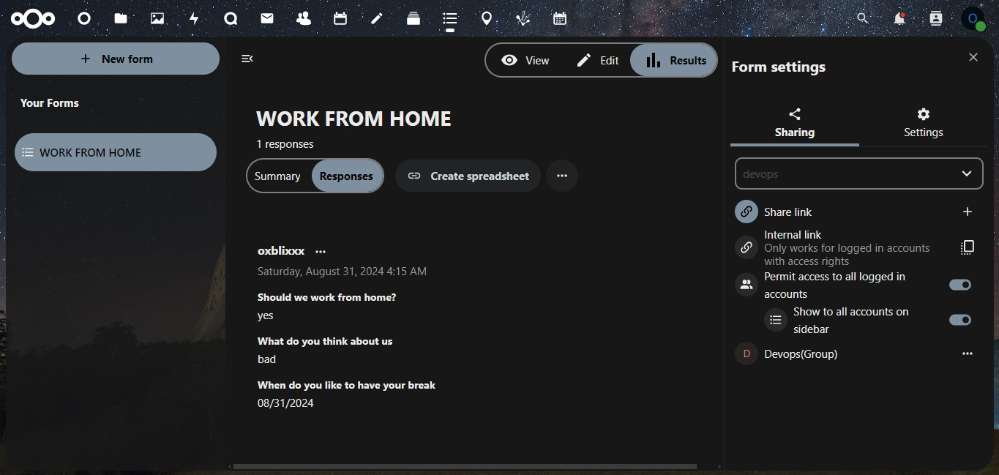

# FORMS APP
## Installing and Using the Forms App in Nextcloud
-  From the Nextcloud console, click on your avatar icon in the top right corner.
- Select Apps from the dropdown menu, and then navigate to the Organization section.
- Locate the Forms app and click on Enable to install it.

## Setting Up a Form:
- Once installed, the Forms app allows administrators to create forms for users or groups.
- From the navbar icons on the console, locate forms icon.
- Click New Form.
- Forms can include various elements such as decisions, dropdowns, checkboxes, radio buttons, etc.
- To start creating a form, click on Add Question to include a new question in your form.

## Previewing and Sharing the Form:
- After adding your questions, click on View to preview the form.
- To share the form, click on Share, type the group name or individual usernames, and choose the recipients.

## Configuring Form Settings:
- Navigate to Settings to configure options such as expiration dates, anonymous responses, and more.

## Submitting and Viewing Responses:
- Adminstrator can submit the form after completing the form.
- To review the submitted responses, go to the Responses tab, where you'll see a list of users who have answered the form.

# MANAGING USERS AND GROUPS IN NEXTCLOUD
## Accessing User Management:
- While users can be managed both through the console and the terminal, this documentation will focus on the console approach.
- From the Nextcloud console, click on your avatar icon in the top right corner, then select Users.

## Creating Users:
- To create a new user, click on Create Account.
- Fill in the required user details, including the username, password, email, and other relevant information.
- Assign the user to a specific group, and optionally designate the group the user should administer.
- You can also set a storage quota for the user.
- Finally, click Create to finalize the creation of the user.

## Creating Groups:
- To create a new group, click on the Plus icon next to groups.
- Enter the group name, and you may be prompted to set a password for the group.

## Account Settings:
- The Account Settings section allows you to modify user preferences, set defaults, and sort users as needed.
- Note that users cannot change their password upon [first login](https://help.nextcloud.com/t/force-password-change-at-user-logon/1664/14). Therefore, it's advisable to create a strong password for each user and enforce a 2FA.

## Managing Users:
- By clicking on the three dots next to a user, administrators can access additional options such as deleting or disabling the user account.
  
